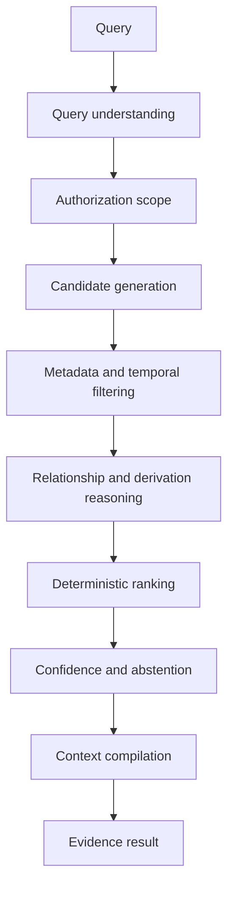

# Trace v0.1 technical design

Status: proposed

Date: 2026-09-15

This document defines the first implementable Trace design. It is deliberately
more conservative than the long-term vision. v0.1 must prove that a portable
canonical memory model is useful before Trace commits to a custom database
engine, distributed service, embedding model, or graph database.

The central recommendation is:

> v0.1 should define a stable logical Trace model and implement `.trc` as a
> SQLite-backed local file with append-only logical history, explicit temporal
> semantics, provenance, policy checks, and rebuildable indexes.

This is not a claim that SQLite is the final Trace storage engine. It is a
decision to use a mature, inspectable, transactional implementation while the
parts that could make Trace valuable are measured and refined.

## 1. Precise problem definition

Applications that use language models accumulate durable information about
people, projects, environments, decisions, and prior interactions. Most
applications currently represent that information as some combination of:

- conversation rows
- application-specific JSON
- vector chunks and embeddings
- key-value profile fields
- graph records
- prompt text assembled by custom code

These representations solve local retrieval problems, but they do not provide
a common contract for what memory means or how it changes. As a result:

- the application schema becomes the memory format
- a vector index can become the de facto source of truth
- updates overwrite earlier beliefs
- the system cannot reliably distinguish when something was learned from when
  it was true
- derived memories lose their supporting evidence
- permissions are applied inconsistently or too late
- deletion is implemented as hiding a result rather than removing its
  dependencies
- changing models or retrieval technologies can make existing memory
  difficult to interpret
- different agents cannot exchange memory without a bespoke adapter

Trace addresses this narrower problem:

> Define a model-independent, inspectable, versioned representation and API
> for durable agent memory whose canonical records preserve evidence,
> temporal validity, change history, policy metadata, and deletion semantics
> independently of any retrieval index or language model.

Trace is not primarily a chat memory feature. It is not primarily a vector
database, graph database, agent framework, or hosted synchronization service.
Those may be adapters or optional implementations later.

### Product test

Trace should exist only if it provides a durable advantage over:

```text
SQLite or Postgres
    + application tables
    + an embedding index
    + application-specific update and deletion logic
```

The advantage must come from a portable semantic contract and reliable
cross-cutting behavior, not from the `.trc` extension itself. The minimum
credible advantage is a common model for:

1. evidence and provenance
2. valid time versus learned time
3. append-only change relationships
4. explainable retrieval
5. policy-aware access
6. dependency-aware forgetting
7. import and export without tying canonical data to embeddings

If Trace cannot demonstrate those advantages, the project should remain a
library and interchange specification rather than becoming a new storage
engine.

## 2. Existing approaches and their weaknesses

The following comparison separates documented behavior from engineering
judgment. Published system results are not treated as independent proof.

### 2.1 Application-owned SQLite or Postgres

This is the strongest baseline, not a legacy approach to dismiss.

Strengths:

- mature transactions and recovery
- familiar query and migration tooling
- flexible schemas
- established language bindings
- predictable operational behavior
- easy integration with full-text and metadata indexes

Weaknesses:

- no shared memory semantics
- no standard distinction between source events and derived memories
- no required provenance or temporal model
- deletion dependencies are application-specific
- explainability and export semantics are application-specific
- two applications can use incompatible schemas while both claim to store
  memory

Trace should initially use SQLite rather than reimplementing these strengths.
Trace's work is to define the logical contract above the database.

### 2.2 Mem0

Mem0's current documentation describes a pipeline that extracts memories from
conversation, performs deduplication and embedding, links entities, and
combines semantic, keyword, entity, and temporal signals during retrieval. Its
documented architecture uses separate SQL, vector, and entity-oriented
storage concerns. Its evaluation material reports results on LoCoMo,
LongMemEval, and BEAM.

Useful ideas:

- separate extraction from retrieval
- retain more than one retrieval signal
- treat temporal metadata as retrieval-relevant
- preserve raw conversation context for extraction and audit

Limitations for Trace:

- the system is primarily a memory service and pipeline, not a portable
  storage specification
- extraction and deduplication are model-dependent
- a deployment's database layout is not the same thing as an exchange format
- documented benchmark results are vendor-associated results and require
  independent reproduction and baseline review
- an add-only fact policy preserves history but does not by itself define
  deletion, authorization, or a portable mutation contract

Trace should learn from the separation of write and read pipelines without
making an extraction model or embedding index canonical.

### 2.3 Letta

Letta documents two useful abstractions:

- editable core memory blocks that are always visible to an agent
- archival memory that is stored externally and searched on demand

This is a practical context-management model. It makes the distinction
between always-in-context state and retrievable durable information explicit.

Limitations for Trace:

- memory blocks are closely coupled to an agent's prompt and runtime state
- agents can directly modify the representation, which is useful operationally
  but does not establish a model-independent provenance graph
- the core/archival split does not by itself define temporal truth, evidence
  dependencies, or cross-agent exchange

Trace can represent a compiled context as a view over canonical records, but
context visibility should not define the canonical record type.

### 2.4 Zep and Graphiti

Zep and the open-source Graphiti project provide a stronger temporal model.
Their published design describes episodes, entities, and facts in a temporal
knowledge graph. Facts carry valid and invalid times, as well as creation and
expiration metadata. Retrieval combines semantic, full-text, and graph
signals, and facts retain lineage to source episodes.

Useful ideas:

- represent changing facts without erasing history
- distinguish world time from system time
- preserve episode-level provenance
- use graph traversal as one retrieval strategy rather than only semantic
  similarity

Limitations for Trace:

- a graph-centric canonical model can overfit relation-heavy use cases
- graph storage and graph construction are operational dependencies
- entity and edge extraction still depends on semantic models
- service-level benchmark claims are not interchangeable with a portable file
  guarantee

Trace should adopt a bi-temporal vocabulary and derivation relationships while
keeping the canonical model usable for simple events and facts that do not
need a graph database.

### 2.5 Model Context Protocol

The Model Context Protocol is a runtime protocol for connecting hosts,
clients, and servers. Its primitives include resources, tools, and prompts;
its messages use JSON-RPC, and capabilities are negotiated during session
initialization.

MCP is relevant to Trace as a future interface. It is not a memory file
format, database schema, provenance model, or permission policy. A Trace MCP
server should expose Trace operations without making MCP types the canonical
storage representation.

### 2.6 Portable memory proposals

Several current proposals target interoperability rather than local storage,
including Portable AI Memory, the AIMEM Bundle draft, and Portable Memory.
They converge on useful concepts such as provenance, lifecycle metadata,
relations, hashes, optional embeddings, checksums, and deletion markers.

Their existence validates the portability problem, but it also changes the
strategic question: Trace should not claim that a new JSON export alone
solves interoperability. It needs a precise local model and round-trip
behavior. Trace should also be able to import and export compatible records
without assuming that any one proposal has become an industry standard.

### 2.7 Why not start with a custom binary format?

A custom binary format could eventually optimize scanning, packing, or
multi-language implementation. At project start it would also create:

- a parser and writer that must be maintained before semantics are proven
- a second crash-recovery problem
- an indexing and compaction problem
- migration obligations before the data model is stable
- more difficult ad hoc inspection
- pressure to make physical layout decisions prematurely

The first engineering question is whether Trace's logical guarantees are
valuable. SQLite is a better experimental foundation until measurements
demonstrate that its limitations materially block Trace's goals.

## 3. Design goals

### 3.1 Primary goals

1. **Canonical independence**
   Facts, events, evidence, relationships, and lifecycle state remain valid
   without embeddings, a particular model, or a retrieval backend.

2. **Inspectability**
   A developer can inspect records, provenance, mutations, temporal windows,
   policy metadata, and validation failures with ordinary tools and the Trace
   CLI.

3. **Correct change semantics**
   New information can confirm, contradict, supersede, expire, or correct
   earlier information without silently overwriting it.

4. **Temporal correctness**
   The model distinguishes when a proposition was true from when Trace
   learned or recorded it.

5. **Provenance by construction**
   A derived memory has explicit links to its source events or supporting
   records.

6. **Safe retrieval**
   Authorization, temporal filters, and conflict state are applied before
   records are returned to a caller.

7. **Real forgetting**
   The system can remove a source and determine which derived records and
   indexes depend on it.

8. **Portability**
   The model can be implemented in multiple languages and exported without
   serializing an embedding as if it were truth.

9. **Incremental evolution**
   The format can add record types and metadata without forcing a rewrite of
   the semantic foundation.

10. **Measurability**
    Performance and retrieval quality claims are backed by reproducible
    benchmarks.

### 3.2 Secondary goals

- simple local installation
- deterministic exact and metadata lookup
- useful operation without an LLM
- optional semantic and graph indexes
- clear boundaries for future REST, SDK, MCP, and hosted implementations

### 3.3 Language decision

Trace will use a deliberate two-language architecture:

- **Go is the authoritative core language**
- **Python is the integration and evaluation language**

This is not two competing implementations. Go owns every behavior that
defines what Trace means. Python owns work that benefits materially from its
model and data-science ecosystem.

#### Go owns the core

The Go implementation owns:

- the canonical memory model
- `.trc` file creation and SQLite access
- serialization and content hashes
- validation and migrations
- temporal logic
- provenance and derivation handling
- retrieval filters, ranking, and abstention state
- permissions and deletion
- crash recovery and index rebuilding
- the official CLI
- the normative local API

Go is a practical core language because it is simpler to learn and maintain
than Rust for this project, produces straightforward cross-platform binaries,
has strong testing and profiling tools, and is sufficient for local services
and index rebuilds. The core does not need to call an LLM.

Go does not include SQLite in its standard library. The storage layer must
therefore isolate the SQLite driver behind a small internal interface. The
initial implementation should evaluate a pure-Go SQLite driver for simple
cross-platform distribution and benchmark it against a CGO-based SQLite
driver before selecting a production default. The driver choice must not
leak into the Trace file format or public API.

The initial Go package boundaries should remain small:

```text
trace/model
trace/format
trace/storage
trace/retrieval
trace/policy
cmd/trace
```

#### Python owns integrations

Python is the preferred language for:

- LLM provider adapters
- extraction and memory-ingestion experiments
- benchmark harnesses and result analysis
- notebooks and research tooling
- an eventual Python SDK

Python is better suited to this layer because model providers, evaluation
libraries, data tooling, and experimental agent frameworks primarily target
Python. These components produce explicit Trace proposals or queries; they
do not define truth, bypass validation, or write SQLite directly.

#### Language boundary

The `.trc` format, JSONL bundle, CLI JSON output, and future HTTP API are
language-neutral contracts. Python integrations communicate with the Go core
through those contracts.

The implementation order is:

1. build the Go core and CLI without a Python runtime dependency
2. expose stable machine-readable CLI operations and bundle import/export
3. add Python extraction and benchmark tooling that calls those operations
4. add a Python SDK only after the Go API and format reach conformance

The Python SDK must not reimplement storage, policy, temporal semantics, or
deletion. It is a client and integration layer over the Go-defined behavior.
This boundary keeps one source of truth while using each language where it is
strongest.

## 4. Non-goals

v0.1 will not attempt to provide:

- a general-purpose distributed database
- a custom vector database
- a custom graph database
- a mandatory embedding model
- automatic truth resolution for arbitrary natural language
- autonomous agents
- a hosted control plane
- multi-region replication
- enterprise identity federation
- a universal ontology for every domain
- a guarantee that all extracted memories are correct
- encryption and key management beyond documented integration boundaries
- a complete MCP server
- multiple language SDKs simultaneously
- a GUI
- transparent network-filesystem concurrency
- physical secure erasure guarantees on every filesystem or storage device

These are not merely deferred implementation tasks. They are excluded from
the v0.1 acceptance criteria.

## 5. Proposed `.trc` data model

### 5.1 Logical layers

Trace uses four logical layers:

```text
event
  ↓
memory record
  ↓
derivation and relationship graph
  ↓
compiled context or retrieval result
```

The layers are related but not interchangeable.

- An **event** is an input or observation that Trace received.
- A **memory record** is a durable proposition or derived representation.
- A **relationship** records support, contradiction, supersession, identity,
  or another explicit connection.
- A **context** is a query-specific projection and is never the source of
  truth.

### 5.2 Record kinds

v0.1 defines these memory kinds:

- `fact`: a proposition extracted from one or more events
- `observation`: a proposition inferred or summarized from other records
- `context`: a query-specific or task-specific compiled representation

Events are not memory kinds. They are source records.

The model must not require every fact to be expressed as a subject-predicate-
object triple. A fact can have structured fields, text, or both. When an
entity relationship is known, the record may additionally use structured
subject, predicate, and object references.

### 5.3 Stable identifiers

Every record has a stable `id`. v0.1 should use UUIDv7 or an equivalent
time-sortable identifier generated by the implementation. The exact algorithm
must be specified before compatibility is promised.

IDs are identifiers, not content hashes. Content hashes are separate fields
used for integrity and deterministic duplicate detection.

### 5.4 Event

An event contains:

```text
id
kind = event
event_type
payload
payload_content_type
occurred_at
recorded_at
namespace
actor
provenance_id
content_hash
extensions
```

`payload` preserves the source material needed to explain a derived memory.
It may be plain text, normalized JSON, or a reference to an external object.
References must state whether the external object is required for a complete
export.

`occurred_at` is optional because the source may not state when something
happened. `recorded_at` is required and means when Trace accepted the event.

Examples of `event_type` include:

- `conversation.message`
- `user.confirmation`
- `tool.observation`
- `document.ingestion`
- `application.import`

The event type is extensible. Unknown event types remain readable.

### 5.5 Memory record

A memory record contains:

```text
id
kind = fact | observation | context
content
structured_value
subject_entity_id
predicate
object_entity_id
object_value
valid_from
valid_to
recorded_at
status
namespace
confidence
provenance_id
content_hash
extensions
```

At least one of `content` or `structured_value` is required. A structured
value may contain a normalized proposition, a preference, a measurement, or a
domain-specific object.

`valid_from` and `valid_to` describe when the proposition is true in the
modeled world. The interval is half-open: `[valid_from, valid_to)`. An open
end means that the end is unknown, not necessarily that the proposition is
currently true.

`recorded_at` describes when this record was written to Trace. It is not the
same as `valid_from`.

`status` is one of:

- `active`
- `superseded`
- `uncertain`
- `invalidated`
- `redacted`

Status is a lifecycle summary. The mutation and relationship records remain
the authoritative explanation for why status changed.

### 5.6 Entities and relationships

Entities are optional named or typed referents:

```text
entity:
  id
  entity_type
  canonical_name
  aliases
  namespace
  provenance_id
  extensions
```

An entity is not necessarily a person. It can represent a project, place,
organization, product, account, or application-defined object.

Relationships are explicit records:

```text
relationship:
  id
  relationship_type
  source_id
  target_id
  recorded_at
  valid_from
  valid_to
  provenance_id
  extensions
```

For v0.1, relationships may connect any supported records, but validation
must reject references to nonexistent IDs. Graph traversal is optional; the
relationship graph is canonical only when the application writes an explicit
relationship.

### 5.7 Provenance

Every event and memory record must have a provenance record, either explicit
or an implementation-generated local provenance record.

Provenance fields:

```text
provenance:
  id
  source_type
  source_id
  source_uri
  agent
  model
  provider
  conversation_id
  message_id
  operation
  created_at
  parent_provenance_ids
  extensions
```

Values that are unavailable are omitted rather than fabricated. In
particular, a model name must not be inferred from an opaque application
environment.

The provenance record identifies origin. A separate derivation record
identifies semantic support.

### 5.8 Derivation and evidence

Derivation records form a directed acyclic graph for normal derivations:

```text
derivation:
  id
  source_id
  target_id
  relation
  created_at
  actor
  extensions
```

v0.1 supports at least these relations:

- `derived_from`
- `supports`
- `contradicts`
- `confirms`
- `supersedes`
- `invalidates`
- `summarizes`

The graph may contain cycles for explicit semantic relationships, but
`derived_from` should be acyclic. Validation reports cycles as errors unless
the implementation is inspecting an imported, non-conforming file.

This distinction allows Trace to answer both:

- where the source came from
- why this record exists

### 5.9 Confidence

Confidence is an extensible evidence object, not a trusted probability:

```text
confidence:
  score
  scale
  basis:
    extraction
    explicit_user_statement
    user_confirmation
    supporting_count
    contradiction_count
    source_reliability
    temporal_recency
  calibrated
  extensions
```

`score` is optional. If present, `scale` is required. v0.1 may define `0..1`
as a conventional scale, but consumers must not interpret it as calibrated
probability unless `calibrated` is explicitly true and the calibration
method is documented.

### 5.10 Namespaces and ownership

Every record belongs to a namespace. A namespace can represent:

- a user
- an agent
- an organization
- an application
- a task
- an imported source

Namespaces are identifiers, not authentication credentials. Access control
maps callers and roles to namespace and record capabilities.

### 5.11 Extensions

Every extensible record may carry an `extensions` object keyed by a
reverse-domain or registered namespace, for example:

```json
{
  "com.example.crm": {
    "account_tier": "pro"
  }
}
```

Unknown extension keys must be preserved by read-modify-write operations
unless the caller explicitly requests removal. Extensions must not change the
meaning of required Trace fields.

### 5.12 Canonical versus derived data

Canonical:

- events
- memory records
- entities
- explicit relationships
- provenance
- derivations
- mutation records
- deletion records or tombstones
- namespace and policy metadata

Derived and rebuildable:

- token indexes
- full-text indexes
- embeddings
- embedding model metadata
- graph traversal caches
- ranking features
- compiled context caches

The loss of an index must never make the canonical memory uninterpretable.

## 6. Proposed storage architecture

### 6.1 v0.1 physical decision

The v0.1 Go reference implementation will write a SQLite database using a
Trace-defined logical schema. The Go implementation language is not part of
the `.trc` format.

This decision provides:

- a single local file in the common case
- cross-platform readers in many languages
- transactions and crash recovery already exercised in production
- ordinary inspection through SQLite tooling
- indexes that can be dropped and rebuilt
- a path to a future custom container without changing the logical model

Trace must set a SQLite application identifier and a Trace schema version.
The database must not be treated as an arbitrary SQLite database merely
because it can be opened by SQLite.

### Why SQLite is used now

Trace has two separate format decisions:

1. the **logical format**: records, relationships, provenance, timestamps,
   hashes, policies, and lifecycle rules defined by Trace
2. the **physical container**: the bytes and transaction mechanism used to
   store those records

The logical format is already Trace's own format. SQLite is only the v0.1
physical container. It provides reliable transactions, crash recovery,
cross-language readers, and ordinary inspection while the logical contract
is still changing.

This avoids spending the first implementation cycle on custom page layout,
journaling, compaction, corruption recovery, and language bindings before
Trace has proven that its semantics are useful. Using SQLite now does not
mean that Trace is a SQL product or that SQL queries become the public
memory API.

The future custom-container plan is:

1. freeze the logical conformance tests and export bundle
2. export representative SQLite files into canonical JSONL records and
   compare IDs, hashes, relationships, and validation results
3. implement a custom reader and writer behind the existing storage boundary
4. run both physical profiles against the same recovery, portability, and
   performance suite
5. add an explicit migration tool that preserves logical IDs and content
   hashes
6. switch the default only if measured workloads show a material advantage

Until those gates pass, SQLite is the safer implementation. A custom
container remains a replaceable optimization, while the logical Trace model
and export format remain the compatibility boundary.

### 6.2 Required logical tables

The reference implementation should define tables equivalent to:

```text
trace_meta
namespace
event
memory
entity
relationship
provenance
derivation
mutation
policy
policy_binding
deletion
```

The exact SQL types and constraints belong in the implementation
specification. The logical requirements are:

- IDs are unique within a file
- foreign references are validated
- required timestamps use an unambiguous encoding
- JSON values are UTF-8 and validated before insertion
- content hashes identify the canonical serialized content
- schema migrations are explicit
- index tables are not the only copy of a record

### 6.3 Manifest and inspectability

`trace_meta` is the in-file manifest. It must contain at least:

```text
format_name = trace
format_version
schema_version
created_at
updated_at
generator
file_id
required_features
```

`trace inspect` exposes this manifest without requiring the caller to know
SQLite details.

For export and archival, Trace also defines a text-readable bundle profile:

```text
manifest.json
events.jsonl
memories.jsonl
entities.jsonl
relationships.jsonl
provenance.jsonl
derivations.jsonl
mutations.jsonl
deletions.jsonl
CHECKSUMS
```

The bundle is an interchange and inspection profile, not a second canonical
semantic model. JSON Lines keeps large exports streamable. A bundle may omit
empty files, but its manifest must state which record classes are present.

### 6.4 Append-only logical history

Memory records should be immutable after creation for semantic fields.
Corrections create a new record and a derivation such as `supersedes` or
`contradicts`.

The `mutation` table records accepted operations:

```text
mutation:
  id
  commit_id
  operation
  target_id
  actor
  created_at
  request_hash
  metadata
```

The mutation history is logical append-only history. It is not a replacement
for SQLite's physical journal.

Operations that redact or forget data may remove sensitive mutation metadata
as part of the deletion contract. A system must not claim that an immutable
audit log and complete erasure are simultaneously guaranteed for the same
data.

### 6.5 Indexes

v0.1 may provide:

- exact ID and hash lookup
- namespace and timestamp indexes
- SQLite full-text search
- optional external semantic index adapters

Embeddings must record:

```text
embedding_model
embedding_dimensions
embedding_revision
source_content_hash
created_at
```

An embedding whose source hash no longer matches the canonical record is
stale and must not be silently used.

### 6.6 Why not WAL by default?

SQLite rollback journaling and WAL both provide recovery behavior, but WAL
creates `-wal` and `-shm` sidecars and has same-host coordination
requirements. Copying only the main file while a WAL is active can lose
committed data or produce an invalid snapshot.

v0.1 should:

- use rollback journaling for the portable single-file profile
- permit WAL for a controlled local service profile
- expose whether a file has pending sidecars
- provide `trace export` and SQLite backup-based snapshots
- reject unsupported network-filesystem concurrency rather than pretending
  it is safe

### 6.7 Future custom container boundary

A future custom `.trc` container is justified only if benchmarks show a
material limitation in at least one of:

- sequential ingest throughput
- random retrieval latency
- storage overhead
- multi-language implementation cost
- portable snapshot behavior
- compaction or integrity validation

The logical schema, export bundle, and conformance tests must be defined
before replacing SQLite. A custom container must continue to expose the same
canonical semantics and rebuild indexes from canonical records.

## 7. Proposed retrieval architecture

Retrieval returns evidence, not an answer. A consuming agent may use the
evidence to formulate an answer, but Trace must preserve whether the result
was exact, inferred, conflicting, weak, or absent.

### 7.1 Pipeline



### 7.2 Query shape

A query may include:

```text
text
namespace_scope
record_kinds
entity_ids
exact_ids
metadata_filters
valid_at
recorded_before
include_superseded
include_sources
include_conflicts
max_results
retrieval_strategies
abstention_policy
caller
```

The API must distinguish a missing filter from an explicit request to include
historical or invalidated records.

### 7.3 Candidate generation

Candidate generators are independent adapters:

- exact ID or hash
- structured field lookup
- SQLite full-text search
- optional keyword search
- optional embedding search
- entity lookup
- relationship traversal
- temporal index lookup

Each candidate reports its source strategy and score. A candidate generator
must not change canonical record state.

### 7.4 Filtering and temporal reasoning

Filtering occurs before context compilation:

1. establish caller and namespace scope
2. remove records the caller cannot read
3. apply explicit record and metadata filters
4. apply valid-time predicates
5. apply recorded-time predicates
6. apply deletion and lifecycle state
7. resolve or expose supported conflicts

For a point-in-time query, a record is temporally applicable only when its
valid interval includes the query time. A record with unknown validity must
not be presented as current solely because it is recent.

v0.1 does not implement universal temporal inference. It provides explicit
interval filtering and relationship metadata.

### 7.5 Conflict and supersession behavior

Trace should not collapse contradictions into a single text result. A
retrieval result contains:

```text
evidence_state:
  supported
  weak
  conflicting
  absent
```

If two records have incompatible structured claims about the same subject and
overlapping validity windows, the default result is `conflicting` unless an
explicit `supersedes` relationship, a caller policy, or a deterministic
domain rule resolves them.

### 7.6 Ranking

The v0.1 default ranking is intentionally explainable. It may combine:

- exact match
- structured filter match
- temporal applicability
- full-text score
- entity overlap
- derivation support
- recency of recorded time
- contradiction penalty
- source reliability metadata

Every score component returned to a caller must identify its source. Semantic
reranking and LLM-based ranking are optional adapters, not required behavior.

### 7.7 Abstention

Trace returns `absent` when no authorized candidate passes the query's
minimum criteria. It returns `weak` when candidates exist but do not meet the
configured evidence threshold. It returns `conflicting` when authorized
evidence disagrees and no deterministic resolution applies.

The caller may request a strict policy that returns no context for `weak` or
`conflicting` results. The consuming agent must not have to infer these states
from an empty list.

### 7.8 Context compilation

Context compilation is a presentation layer:

- select records and evidence
- include provenance references
- include valid and recorded times
- include conflict state
- enforce token or byte budget
- preserve stable record IDs

The compiler must not silently rewrite a fact into a stronger claim. A
compiled context should be reproducible from a query, a file snapshot, and a
compiler version.

## 8. API design

The normative v0.1 API is a small synchronous Go package. The examples below
use the intended Go shape. A future Python SDK may mirror these operations,
but its behavior must be defined by the Go implementation and the Trace
conformance tests.

### 8.1 Store lifecycle

```go
store, err := trace.Open("memory.trc", trace.ReadWrite)
if err != nil {
    return err
}
defer store.Close()

if err := store.Validate(); err != nil {
    return err
}
```

`open` must state whether it opens read-only or read-write. A read-only open
must never create indexes or migrations implicitly.

### 8.2 Write operations

```go
eventID, err := store.AddEvent(ctx, trace.EventInput{
    EventType:   "conversation.message",
    Payload:     `{"role":"user","content":"I prefer Go"}`,
    RecordedAt:  "2026-09-15T19:00:00Z",
    Provenance:  provenance,
    Namespace:   "user:tim",
})
if err != nil {
    return err
}

memoryID, err := store.Remember(ctx, trace.MemoryInput{
    Kind:    "fact",
    Content: "Tim prefers Go",
    StructuredValue: map[string]any{
        "subject":  "user:tim",
        "predicate": "prefers",
        "object":   "Go",
    },
    ValidFrom:   nil,
    Provenance:  provenance,
    DerivedFrom: []string{eventID},
    Namespace:   "user:tim",
)
if err != nil {
    return err
}
```

`remember` writes a record. It does not promise semantic deduplication or
truth resolution. A higher-level ingestion layer may propose a mutation, but
the accepted mutation must be explicit and inspectable.

### 8.3 Read operations

```go
result, err := store.Recall(ctx, trace.Query{
    Text:          "What language does Tim prefer?",
    NamespaceScope: []string{"user:tim"},
    Caller:        "agent:coding",
    IncludeSources: true,
})
if err != nil {
    return err
}
```

The result includes:

```text
records
evidence_state
provenance
relationships
score_breakdown
snapshot
warnings
```

`recall` is a convenience API over the retrieval pipeline. `query` may expose
structured filtering without semantic interpretation.

### 8.4 Explain and history

```go
explanation, err := store.Explain(ctx, memoryID)
history, err := store.History(ctx, memoryID)
changes, err := store.Diff(ctx, snapshotA, snapshotB)
```

`explain` returns source events, provenance, derivations, lifecycle mutations,
and retrieval reasons. It must not invoke an LLM merely to produce a
human-readable explanation.

### 8.5 Forget

```go
err := store.Forget(ctx, trace.ForgetRequest{
    TargetID: eventID,
    Mode:     "dependency_closure",
    Actor:    "user:tim",
})
```

The operation computes affected derivations, writes a deletion plan, removes
or redacts canonical data according to policy, removes affected index entries,
and validates that no live record references removed content.

`mode="target_only"` is allowed only when the caller accepts dangling
derivation references being removed or marked unresolved. The default is
`dependency_closure`.

### 8.6 Export and import

```go
err := store.Export(ctx, "memory-bundle", trace.ExportOptions{
    IncludeEmbeddings: false,
})
if err != nil {
    return err
}

err = trace.ImportBundle(ctx, "memory-bundle", "imported.trc", trace.Merge)
```

Import must support at least:

- `new`: reject an existing target
- `merge`: preserve IDs when collision-free and record mapping otherwise
- `replace`: explicit destructive replacement, disabled by default

Imports are untrusted input. They must validate before commit and must not
execute embedded code or fetch external references automatically.

## 9. CLI design

The CLI is a debugging and inspection interface, not only a user-facing
wrapper.

### 9.1 v0.1 commands

```text
trace init FILE
trace add FILE
trace remember FILE
trace query FILE QUERY
trace search FILE QUERY
trace inspect FILE
trace validate FILE
trace explain FILE RECORD_ID
trace history FILE [RECORD_ID]
trace diff FILE SNAPSHOT_A SNAPSHOT_B
trace forget FILE RECORD_ID
trace export FILE DESTINATION
trace import SOURCE FILE
```

The implementation may combine `query` and `search` if their output contracts
remain distinct:

- `query` is structured and deterministic
- `search` may use configured keyword or semantic adapters

### 9.2 Output rules

Human output should be concise but expose:

- record ID
- kind and status
- relevant time windows
- confidence basis
- evidence state
- provenance references

Every command must support a machine-readable JSON output mode. Errors must
include an actionable category, such as invalid format, unauthorized,
conflict, missing dependency, or corrupt storage.

### 9.3 CLI non-goals

The v0.1 CLI will not:

- run an agent
- call a hosted model implicitly
- install or manage vector databases
- change permissions through a guessed policy
- conceal corrupted records by default

## 10. Versioning strategy

Trace has separate versions for the physical format, logical schema, API, and
optional index adapters.

### 10.1 Format identity

Every `.trc` file declares:

```text
format = trace
format_version = major.minor
schema_version = integer or major.minor
```

`format_version` describes the on-disk contract. `schema_version` describes
the relational or logical model. API versions are independent.

### 10.2 Compatibility

- Patch changes must preserve read and write behavior.
- Minor changes may add optional fields or record types.
- Major changes may remove or change required semantics.
- A reader may open an unknown future minor version in read-only mode only
  when it can safely preserve unknown fields.
- A reader must reject an unknown future major version.
- A writer must never silently downgrade a file.

The precise compatibility matrix belongs in the conformance specification.

### 10.3 Migrations

Migrations are explicit, versioned, and transactional:

```text
trace migrate FILE --to VERSION
```

The tool must create a verified backup or require an explicit snapshot path
before a destructive migration. A migration records its source version,
target version, implementation version, and timestamp.

### 10.4 Unknown fields and extensions

Unknown extension fields are preserved. Unknown required fields cause a
validation failure or a read-only compatibility mode; they must not be
silently discarded.

### 10.5 Import and export compatibility

The `.trc` SQLite file is Trace's local storage profile. The JSONL bundle is
Trace's portable interchange profile. They share logical semantics but have
different operational guarantees.

Importers and exporters must be versioned independently because external
provider formats change. Provider-specific adapters are best-effort and must
record:

- source format and version
- adapter version
- fields mapped losslessly
- fields approximated or dropped
- unresolved identifiers

### 10.6 Conformance levels

Future implementations can declare:

- reader: can inspect a conforming file
- writer: can create a conforming file
- round-trip: import/export preserves required semantics
- policy-aware: enforces authorization and deletion contracts
- indexed: provides optional retrieval adapters

v0.1 should require reader, writer, validation, and round-trip behavior for
the reference implementation.

## 11. Crash and recovery strategy

### 11.1 Transaction boundaries

Each public mutation is one SQLite transaction unless the API explicitly
opens a batch. A batch has one commit ID and is either wholly visible or not
visible.

The transaction must include:

- canonical record changes
- provenance and derivation records
- mutation entries
- deletion metadata
- required index updates

Optional indexes may be rebuilt after commit, but the operation must mark
them stale and retrieval must not treat stale data as current.

### 11.2 Startup recovery

On open, the implementation:

1. lets SQLite recover its transaction state
2. checks application ID and version
3. validates the manifest
4. checks required schema constraints
5. detects stale or missing rebuildable indexes
6. reports integrity warnings without hiding them

`trace validate --repair-indexes` may rebuild derived indexes. It must not
rewrite canonical records without an explicit migration.

### 11.3 Integrity

Canonical records use content hashes over a defined canonical serialization.
The hash algorithm and serialization rules must be stable within a format
version.

Validation checks:

- file identity
- schema version
- required columns and constraints
- JSON validity
- hash correctness
- foreign references
- derivation acyclicity where required
- temporal interval validity
- deletion closure
- policy references

Checksums detect corruption; they do not prove authenticity. Signed bundles
and authenticated encryption are future features.

### 11.4 Partial writes and corruption

SQLite transaction recovery protects committed transactions within its
supported filesystem assumptions. If a file is damaged beyond SQLite
recovery, Trace must:

- open in a diagnostic mode when possible
- identify the first invalid invariant
- preserve the original file
- export recoverable records separately
- never silently drop records

Crash testing must terminate the process at write checkpoints and compare
the recovered file to the last committed snapshot.

### 11.5 Concurrency

v0.1 supports:

- multiple readers on a local filesystem
- serialized writers through SQLite locking
- one process or a controlled local service owning write coordination

It does not support multiple machines writing the same file over a network
filesystem. A future server profile may expose Trace over a network while
keeping the database process adjacent to storage.

## 12. Security and privacy model

### 12.1 Threat model

v0.1 assumes:

- the local host and filesystem may be attacked if file permissions are weak
- imported bundles may be malicious or malformed
- model-generated content is untrusted input
- a caller may attempt cross-namespace access
- indexes can leak information if not deleted
- provenance can itself contain sensitive data

v0.1 does not protect against a fully compromised host or a process that can
read the database file directly.

### 12.2 Authorization

Authorization is evaluated by the Trace library before returning records.
Policies can constrain:

- namespace
- record kind
- entity
- field or extension
- operation
- caller identity
- purpose or task

The default for an unknown caller is deny. A local trusted mode may grant
full access only through an explicit configuration option.

The consuming model is never the policy enforcement point.

### 12.3 Policy records

Policies and bindings are canonical metadata:

```text
policy:
  id
  effect = allow | deny
  principal
  operation
  resource_selector
  conditions
  created_at
  expires_at
```

Conflict resolution must be deterministic. v0.1 should use explicit deny
precedence over allow and fail closed when a required policy condition cannot
be evaluated.

### 12.4 Deletion

`forget` is a lifecycle operation, not only a query filter. It must:

1. identify the target and dependency closure
2. revoke live visibility
3. remove or redact dependent records according to policy
4. remove full-text and semantic index entries
5. remove external index references when adapters support deletion
6. validate that no returned record depends on removed content

There are two different promises:

- **logical forgetting**: the record is no longer readable through Trace
- **physical erasure**: bytes are removed or overwritten as far as the
  storage and filesystem permit

v0.1 can provide logical forgetting and best-effort physical erasure. It must
not claim secure media erasure. A cryptographic hash or deletion audit record
may itself be sensitive and must be covered by the deletion policy.

### 12.5 Encryption

Encryption at rest is not built into the v0.1 file format. Users should use
filesystem or volume encryption for local files. A future encrypted bundle
profile may define authenticated encryption and key rotation, but an
unencrypted `.trc` file must never imply confidentiality.

### 12.6 Import safety

Import validates structure before commit and treats payloads as data. It must
not:

- execute code
- fetch URLs
- load arbitrary extensions
- create policies granting the importer more access
- overwrite an existing file without explicit confirmation

## 13. Benchmark methodology

Trace will not claim to be technically superior until it is compared with
credible baselines.

### 13.1 Questions to measure

Storage:

- file size per canonical record
- index size
- bundle export size
- snapshot size

Performance:

- append latency
- read latency
- exact lookup latency
- keyword query latency
- temporal query latency
- relationship traversal latency
- optional semantic retrieval latency
- update and supersession latency
- deletion and dependency-closure latency
- startup and validation time
- index build and rebuild time

Correctness:

- provenance coverage
- temporal point-in-time accuracy
- conflict detection
- supersession handling
- abstention precision
- deletion closure correctness
- authorization leakage rate
- import/export round-trip loss

Reliability:

- recovery after interrupted writes
- corruption detection rate
- committed-record loss
- stale-index detection

### 13.2 Dataset sizes

Run staged datasets at:

- 1,000 records
- 10,000 records
- 100,000 records
- 1,000,000 records
- 10,000,000 records when the harness and hardware make it practical

Each dataset should include:

- direct preferences
- changing facts
- contradictory claims
- multi-hop relationships
- missing dates
- explicit confirmations
- derived observations
- deletion dependencies
- multiple namespaces and policy boundaries

The harness must separate raw events from derived memories so ingestion and
retrieval costs are not confused.

### 13.3 Baselines

At minimum:

1. SQLite tables with exact and metadata queries
2. SQLite plus full-text search
3. SQLite plus an embedding index
4. an application-level JSON or vector baseline
5. a temporal graph baseline when a reproducible local implementation is
   available

The Trace reference implementation should be compared both with indexes
enabled and with indexes rebuilt from canonical data.

### 13.4 Public evaluations

Use public datasets according to their licenses and document their limits:

- LoCoMo for long-term conversational questions and temporal, multi-hop, and
  adversarial categories
- LongMemEval for information extraction, multi-session reasoning, temporal
  updates, and abstention
- MemoryAgentBench for incremental interactions, retrieval, test-time
  learning, long-range understanding, and selective forgetting/conflict
  resolution

These benchmarks evaluate systems and agents, not only file formats. Results
must report the model, prompt, extraction policy, retrieval policy, and
whether a judge model was used.

### 13.5 Evaluation protocol

Every benchmark run records:

- Trace version and schema version
- baseline version
- operating system and hardware
- runtime and database versions
- embedding model and revision, if any
- language model and temperature, if any
- dataset hash
- seed
- warm or cold cache
- concurrency
- p50, p95, and p99 latency
- errors and abstentions

Use exact and structured evidence metrics wherever possible. LLM-as-judge
results are secondary and must be labeled as such.

### 13.6 Success criteria

Before investing in a custom physical format, Trace should demonstrate:

- lossless round-trip for the v0.1 logical model
- deterministic validation and explain output
- no unauthorized records returned in policy tests
- dependency-aware forgetting with no live dangling data
- correct point-in-time behavior for a defined test suite
- crash recovery with no loss of committed transactions under supported
  filesystem assumptions
- competitive local lookup performance against the SQLite baseline
- a measurable portability or explainability advantage over an
  application-specific schema

The criteria should use thresholds selected after the first baseline run,
not invented performance claims.

## 14. Major technical risks

### 14.1 The format may not add enough value

SQLite plus a well-designed application schema may already solve most local
use cases. This is the primary product risk. The benchmark must measure
interoperability, explainability, and lifecycle behavior—not only latency.

### 14.2 Semantic extraction remains difficult

A stable file does not make an extracted fact correct. Trace must keep
extraction adapters separate from storage and report uncertainty rather than
turning model output into truth.

### 14.3 Generic models become vague models

Supporting every memory type through arbitrary JSON can make interoperability
meaningless. Required fields, relation semantics, and conformance tests must
remain strict enough to be useful.

### 14.4 Temporal ambiguity

Users often state facts without dates, and natural language can mix event
time, belief time, and recording time. Trace should preserve unknowns and
require explicit temporal evidence rather than inventing intervals.

### 14.5 Conflict resolution can become hidden policy

A ranking score is not truth resolution. Supersession, contradiction, and
confirmation must be explicit relationships or documented deterministic
rules.

### 14.6 Deletion conflicts with history

An immutable audit log can preserve evidence that a user asked to forget.
Trace must choose the applicable privacy contract and make the tradeoff
visible. It cannot promise both complete erasure and permanent auditability
of the erased content.

### 14.7 Authorization leakage through indexes

Filtering after semantic search can leak existence through timing, scores, or
errors. Candidate generation must carry namespace and policy scope, and
outputs must be filtered before exposure.

### 14.8 Embedding drift

Embeddings are model- and revision-dependent. They must remain optional,
tagged accelerators that can be discarded and rebuilt from canonical text.

### 14.9 SQLite limits

SQLite is a strong local foundation but is not a distributed storage system
and has operational caveats around WAL sidecars and network filesystems.
Trace must document these limits instead of hiding them behind `.trc`.

### 14.10 Benchmark overfitting

Optimizing for LoCoMo or a single synthetic dataset can produce misleading
progress. Include generated invariant tests, adversarial cases, independent
datasets, and operational measurements.

## 15. What should be built first

### Phase 0: conformance and invariants

Write tests and a short logical specification for:

- identifiers
- timestamps and half-open intervals
- canonical serialization and hashes
- required provenance
- derivation relations
- status transitions
- namespace and policy evaluation
- deletion closure
- import/export mapping

No embedding or LLM dependency is allowed in this phase.

### Phase 1: minimal `.trc` reference

Implement:

- SQLite-backed file creation
- manifest metadata
- event and memory records
- provenance
- derivations
- validation
- atomic writes
- inspect and JSON output
- round-trip tests

The first usable artifact should create, write, read, validate, and inspect a
`.trc` file.

### Phase 2: temporal and change semantics

Add:

- valid and recorded time queries
- confirmation
- contradiction
- supersession
- history
- explain
- deterministic structured lookup

Use hand-authored fixtures before model-generated extraction.

### Phase 3: local retrieval

Add:

- exact lookup
- metadata filters
- SQLite full-text search
- evidence states
- abstention thresholds
- reproducible context compilation

Measure against SQLite baselines before adding semantic retrieval.

### Phase 4: permissions and forgetting

Add:

- namespace-scoped policy evaluation
- deny precedence
- dependency-aware forget
- index deletion and rebuild tests
- negative authorization tests
- logical and best-effort physical erasure documentation

### Phase 5: optional retrieval adapters

Add semantic, entity, and relationship indexes as independently versioned
adapters. An adapter must be able to rebuild from canonical records and must
not change the file's meaning when absent.

### Phase 6: benchmark harness

Implement benchmark dataset loading, crash injection, scale generation,
latency measurement, correctness oracles, and report serialization.

Only after this phase should Trace decide whether the SQLite physical profile
needs replacement or optimization.

### Phase 7: compatibility interfaces

Implement the Go package and CLI first, then one external SDK, then an MCP
adapter if actual use cases justify them. The order should follow evidence
from users rather than the long-term interface list.

## 16. What should explicitly not be built yet

Do not build these in v0.1:

- custom binary pages or a custom database engine
- mandatory embeddings
- a hosted vector or graph service
- automatic background consolidation
- universal entity resolution
- model-specific memory semantics
- autonomous conflict resolution
- distributed locking
- replication and synchronization
- multi-region storage
- enterprise billing
- a GUI dashboard
- every SDK
- a full MCP product surface
- provider-specific migration adapters before the core model is tested
- encryption key management without a concrete deployment threat model
- large-scale optimization without benchmark evidence

The strongest early deliverable is a small, boring, inspectable `.trc` file
that can prove:

```text
source event
  → derived fact
  → temporal update
  → explainable retrieval
  → policy-filtered result
  → dependency-aware forgetting
```

If that sequence is not reliable, adding a graph engine, embeddings, or a
distributed service will make the system harder to inspect without solving
the foundational problem.

## Appendix A: proposed end-to-end example

1. A conversation event records that Tim said he prefers Go.
2. A fact record states `Tim prefers Go`.
3. The fact links to the event through `derived_from`.
4. A later event says Tim prefers Python for data analysis.
5. Trace records a second fact with its own valid scope rather than blindly
   overwriting the first.
6. If a later event says Tim now prefers Go generally, Trace records a new
   fact and an explicit `supersedes` or `contradicts` relationship according
   to the ingestion decision.
7. A query for current backend-language preference applies namespace,
   temporal, and conflict policy before ranking.
8. `trace explain` shows all supporting events and the lifecycle decisions.
9. `trace forget` on the original conversation event computes dependent facts,
   invalidates or removes them according to policy, deletes index entries,
   and validates that the forgotten source is not returned.

This example is intentionally ordinary. Trace succeeds if ordinary memory
changes remain inspectable and correct across model, index, and agent changes.

## Appendix B: research basis

Research was reviewed on 2026-09-15. These sources informed the design but do
not constitute endorsements or independent validation of every claim:

- [Mem0 memory evaluation](https://docs.mem0.ai/core-concepts/memory-evaluation)
- [Mem0 architecture](https://docs.mem0.ai/core-concepts/how-it-works)
- [Letta stateful agents](https://docs.letta.com/guides/core-concepts/stateful-agents/index.md)
- [Letta memory blocks](https://docs.letta.com/guides/core-concepts/memory/memory-blocks/index.md)
- [Letta archival memory](https://docs.letta.com/guides/core-concepts/memory/archival-memory/index.md)
- [Zep temporal knowledge graph paper](https://arxiv.org/abs/2501.13956)
- [Graphiti repository](https://github.com/getzep/graphiti)
- [MCP specification](https://modelcontextprotocol.io/specification/2025-11-25/index)
- [Portable AI Memory specification](https://portable-ai-memory.org/spec/v1.0/)
- [AIMEM Bundle draft](https://www.ietf.org/archive/id/draft-vu-aimem-bundle-00.html)
- [LoCoMo benchmark](https://snap-research.github.io/locomo/)
- [MemoryAgentBench research](https://arxiv.org/html/2507.05257v3)
- [SQLite file format](https://sqlite.org/fileformat.html)
- [SQLite write-ahead logging](https://www2.sqlite.org/wal.html)
- [SQLite atomic commit](https://sqlite.org/atomiccommit.html)

Vendor documentation and vendor-associated papers are identified as such.
Future implementation work must record independent reproductions separately.

## Appendix C: future roadmap

This roadmap is deliberately capability-based rather than date-based. A
phase is complete only when its exit criteria are met and the result is
documented. Later phases must not silently weaken the invariants established
by earlier phases.

### Roadmap principles

- stabilize semantics before optimizing physical storage
- keep the Go core authoritative
- use Python where model integration, experimentation, and evaluation benefit
  from its ecosystem
- make every index rebuildable from canonical records
- make every public behavior testable without an LLM where possible
- preserve readable export and import paths at every format version
- do not add distributed infrastructure until local limits are measured
- treat benchmark results as decision inputs, not marketing claims

### Phase 0: design and conformance baseline

Status: complete

Deliverables:

- finalized v0.1 logical model
- canonical serialization rules
- identifier and timestamp rules
- provenance and derivation invariants
- policy and deletion invariants
- initial compatibility matrix
- Go module and package skeleton
- test fixtures for valid and invalid records

Exit criteria:

- the model can represent events, facts, observations, provenance, temporal
  intervals, conflicts, and derivations without an LLM
- every required invariant has a named test
- the design identifies what is canonical and what is rebuildable

### Phase 1: minimal Go `.trc` implementation

Status: implemented in the Go core

Deliverables:

- `trace init`
- SQLite-backed `.trc` creation
- manifest metadata
- event, memory, provenance, entity, and derivation writes
- deterministic reads
- validation
- JSON output
- atomic transactions
- round-trip tests

Exit criteria:

- a developer can create, write, read, inspect, and validate a `.trc` file
- a corrupt or incompatible file produces a diagnostic error
- no LLM, embedding service, or Python runtime is required
- the reference file can be opened by a second supported implementation
  profile or inspected with standard SQLite tooling

### Phase 2: temporal memory and change history

Status: implemented in the Go core

Deliverables:

- valid-time and recorded-time queries
- confirmation, contradiction, and supersession relationships
- mutation history
- `trace history`
- `trace diff`
- deterministic `trace explain`
- point-in-time fixture suite

Implementation decisions:

- valid-time queries use half-open intervals and exclude records without a
  known start time
- current queries default to the current instant and exclude superseded,
  invalidated, and redacted records
- historical point-in-time queries include superseded records when their
  validity interval matches
- recorded-time filters are independent of valid-time filters
- explicit `contradicts`, `confirms`, and `supersedes` edges are append-only
- contradictions remain visible as conflict groups until an explicit
  supersession edge resolves them
- mutation sequences provide logical snapshots without pretending to recreate
  state that was never recorded
- explanations are deterministic and include source records, provenance,
  derivations, and related mutations

Exit criteria:

- historical truth is not overwritten by later updates
- current-state and point-in-time queries produce distinct, tested results
- every derived record can identify its source and lifecycle changes
- unresolved conflicts are exposed instead of silently collapsed

### Phase 3: deterministic local retrieval

Status: implemented in the Go core

Deliverables:

- exact lookup
- structured metadata filters
- namespace filtering
- SQLite full-text search
- evidence states
- abstention thresholds
- reproducible context compilation
- score breakdowns

Implementation decisions:

- retrieval searches canonical memories by default and can explicitly include
  source events
- SQLite FTS5 is a rebuildable accelerator; canonical records remain the
  source of truth
- exact IDs and content hashes are deterministic lookup paths independent of
  full-text availability
- scores combine exact, text, metadata, temporal, recency, and conflict
  components with stable ID tie-breaking
- strict retrieval omits compiled context for weak or unresolved conflicting
  evidence while retaining the structured result
- namespace scope and temporal filters are applied before ranking and context
  compilation

Exit criteria:

- retrieval works without embeddings
- authorization and temporal filtering occur before returned context
- `supported`, `weak`, `conflicting`, and `absent` results are distinguishable
- retrieval performance is measured against a plain SQLite baseline

### Phase 4: policy and deletion

Status: implemented in the Go core

Deliverables:

- namespace-scoped policies
- caller and operation authorization
- deny precedence
- dependency-aware `trace forget`
- tombstone or redaction rules
- index deletion
- deletion validation
- negative authorization tests

Implementation decisions:

- protected APIs use an explicit principal, operation, and optional purpose
  access context
- policy evaluation is exact-match for principal, operation, namespace, record
  kind, and record ID, with deny precedence and fail-closed defaults
- dependency-closure forgetting follows `derived_from` edges and commits
  tombstones or redactions atomically
- tombstones remove canonical records and retrieval documents; redactions
  retain stable identity while replacing sensitive payloads and hashes
- repeated forget requests are idempotent, and validation checks policy and
  deletion metadata

Exit criteria:

- unauthorized records are never returned through supported APIs
- forgetting a source removes or invalidates dependent records according to
  the documented policy
- full-text and optional index entries do not retain forgotten content
- logical forgetting and best-effort physical erasure are clearly separated

### Phase 5: Python integration layer

Deliverables:

- Python extraction adapter
- provider-neutral extraction proposal format
- Python benchmark runner
- result analysis tools
- batch ingestion through versioned Go JSON/JSONL operations

Exit criteria:

- Python can submit events and proposed memories without writing SQLite
  directly
- Go remains responsible for validation, authorization, and commits
- provider-specific fields are preserved as extensions or recorded as
  unmapped
- extraction failures do not create partially committed memory

The first Python deliverable is integration tooling, not a second Trace core.
A native Python SDK should wait until the Go API has conformance tests.

### Phase 6: optional semantic and relationship indexes

Deliverables:

- embedding index adapter
- embedding metadata and stale-index detection
- entity lookup adapter
- relationship traversal
- hybrid candidate generation
- adapter-specific benchmarks

Exit criteria:

- indexes can be deleted and rebuilt from canonical records
- changing embedding models does not change canonical memory
- semantic retrieval is compared against exact and full-text baselines
- permission filtering is enforced before semantic results are exposed

No embedding provider becomes mandatory in this phase.

### Phase 7: public API and one SDK

Deliverables:

- versioned local JSON API or HTTP API
- stable error categories
- one supported Python SDK
- API compatibility tests
- examples for Go and Python callers

Exit criteria:

- the SDK does not expose behavior unavailable through the Go core
- API requests and responses are versioned
- SDK round-trips preserve IDs, timestamps, provenance, extensions, and
  deletion state
- API authorization behavior matches direct local calls

MCP integration should be evaluated after this phase. MCP is an interface
adapter, not a replacement for the Trace API or file format.

### Phase 8: interoperability and migration

Deliverables:

- complete Trace JSONL bundle profile
- import/export conformance suite
- provider adapter framework
- loss and approximation reports
- stable identifier mapping for merges
- signed or integrity-verified bundle design if required by users

Exit criteria:

- a bundle can round-trip without semantic loss for all required v0.1
  records
- unsupported source fields are preserved or explicitly reported
- imports are idempotent under the documented merge rules
- no provider-specific schema becomes canonical

### Phase 9: reliability and performance hardening

Deliverables:

- crash-injection harness
- corruption and recovery tests
- benchmark datasets at 1K, 10K, 100K, 1M, and practical larger scales
- cold-start and rebuild measurements
- concurrent reader and serialized writer tests
- storage-size reports
- documented SQLite driver decision

Exit criteria:

- recovery behavior is characterized under supported filesystem assumptions
- performance bottlenecks are supported by measurements
- custom storage is adopted only if SQLite fails a documented requirement
- all optimization claims include reproducible benchmark data

### Phase 10: open specification and v1.0 readiness

Deliverables:

- public logical format specification
- reference conformance suite
- compatibility and migration policy
- at least one independent reader
- at least one independent importer or exporter
- security and privacy review
- published benchmark methodology and baseline results

Exit criteria:

- another implementation can read the format without depending on the Go
  source code
- the canonical model is stable enough to promise compatibility
- the project can explain why Trace is more useful than an application-owned
  SQLite schema
- unresolved limitations are documented rather than hidden

### Decision gates

The following decisions must remain evidence-driven:

1. **Custom storage gate**
   Do not replace SQLite unless measured workload limits justify the cost of a
   new physical format.

2. **Semantic index gate**
   Do not make embeddings mandatory unless they improve the target retrieval
   tasks enough to justify operational and model-version complexity.

3. **Python SDK gate**
   Do not freeze a Python SDK surface until the Go API and format have
   conformance tests.

4. **MCP gate**
   Do not build an MCP server until a stable Trace API exists and real
   clients need that interface.

5. **Distributed deployment gate**
   Do not add replication, synchronization, or hosted storage until local
   concurrency and scale measurements demonstrate that they are necessary.

6. **v1.0 gate**
   Do not promise long-term format compatibility until independent
   read/write or import/export testing succeeds.

The roadmap is successful if each phase produces a usable, inspectable
artifact and if a phase can be stopped without invalidating existing `.trc`
files.
